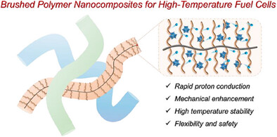

*Nanocomposites from Polymer Brushes and Metal Oxide Clusters for Fabrication of High-Temperature Fuel Cell Proton Exchange Membranes*

[Link to the paper](https://doi.org/10.1002/smll.202504372)

We developed a new class of high-temperature proton exchange membranes (HT-PEMs) designed for fuel cells operating under harsh, water-free conditions. These membranes combine polymer brush architectures with super acidic metal oxide clusters (H₃PW₁₂O₄₀, or PW12) to address long-standing challenges in mechanical stability, proton conductivity, and gas barrier performance.

The design decouples mechanical strength from proton transport: flexible PEG side chains interact with PW12 to enable fast proton hopping, while rigid polymer backbones maintain stability at temperatures up to 250 °C. Our membranes support exceptionally high PW12 loadings (~80 wt.%), allowing anhydrous proton conductivity of 2 × 10⁻³ S/cm at 200 °C, along with strong gas barrier properties and processability.

Fuel cells incorporating these membranes demonstrated high power density (218 mW/cm² at 180 °C) and long-term operational stability, marking a significant step forward for high-energy-density fuel cell technology.
