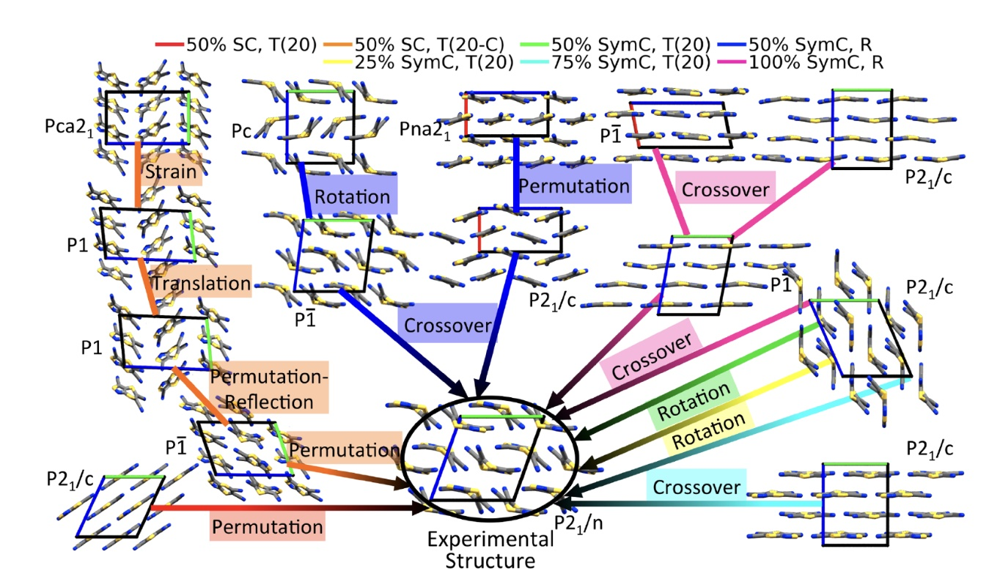

---

**GAtor: a massively parallel genetic algorithm for molecular crystal structure prediction**

Genetic algorithms (GAs) rely on the evolutionary principle of survival of the fittest to perform global optimization. The target property is mapped onto a fitness function, and structures with higher fitness values have an increased probability of “mating” and propagating their structural “genes.” This process is iterated until an optimum is found.

**GAtor** introduces three key innovations:

1. **Specialized crossover and mutation operators** for molecular crystals, designed to balance exploration and exploitation while either breaking or preserving space-group symmetries.
2. **Evolutionary niching**, which reduces initial pool bias and selection bias by clustering structures and applying a cluster-based fitness function to preserve diversity.
3. **Massive parallelization**, achieved by launching multiple GA instances that interact only through a shared population, enabling efficient scaling across HPC resources.

Best practice for crystal structure prediction is to run GAtor multiple times with different settings. As illustrated in the figure below, the experimental structure of tricyano-1,4-dithiino\[c]-isothiazole (TCS3) was reproduced in seven independent GAtor runs, each exploring distinct evolutionary routes from the initial pool. A central innovation is evolutionary niching: machine learning–based clustering of candidate structures, combined with cluster-weighted fitness evaluation, which maintains diversity and mitigates genetic drift. Candidate structures are then re-ranked with increasingly accurate DFT methods.

**Recent developments.** I have integrated GAtor with multiple machine learning interatomic potentials (MLIPs), expanded its library of crossover and mutation operators, and improved computational efficiency. The framework has been extended to support challenging cases including **Z′ = 0.5 crystals, flexible molecules, and multicomponent molecular crystals.** Furthermore, we have enabled **PXRD-guided GAtor runs**, where experimental powder diffraction patterns can steer the evolutionary search. Several publications detailing these advances are in preparation.

---

Source: <a href="https://pubs.acs.org/doi/full/10.1021/acs.jctc.7b01152"><i class="paper icon "></i>Doi:10.1021/acs.jctc.7b01152</a>
