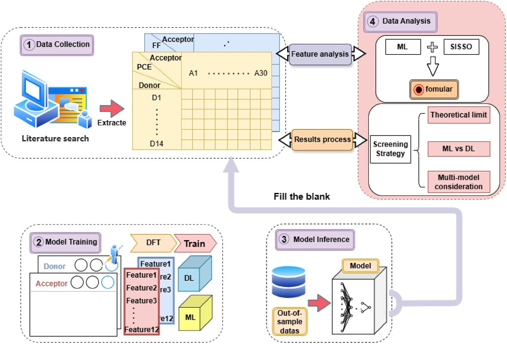

This work builds a machine learning framework to evaluate the performance of organic solar cells (OSCs). Our team collected ~100 reported bulk heterojunction OSCs (14 donors, 30 acceptors) and calculated 12 intrinsic molecular features using DFT. These descriptors were used to train models, where neural networks achieved strong predictive accuracy (Pearson r ≈ 0.88) for key device metrics like PCE, Jsc, Voc, and FF. To interpret the predictions, they applied SISSO and SHAP analyses, identifying Fermi energy and HOMO as critical features. Finally, they benchmarked results against theoretical efficiency limits and introduced a confidence scoring system, confirming the reliability of their predictions. Overall, this approach provides a fast, reliable way to screen donor–acceptor combinations without exhaustive experimental testing.